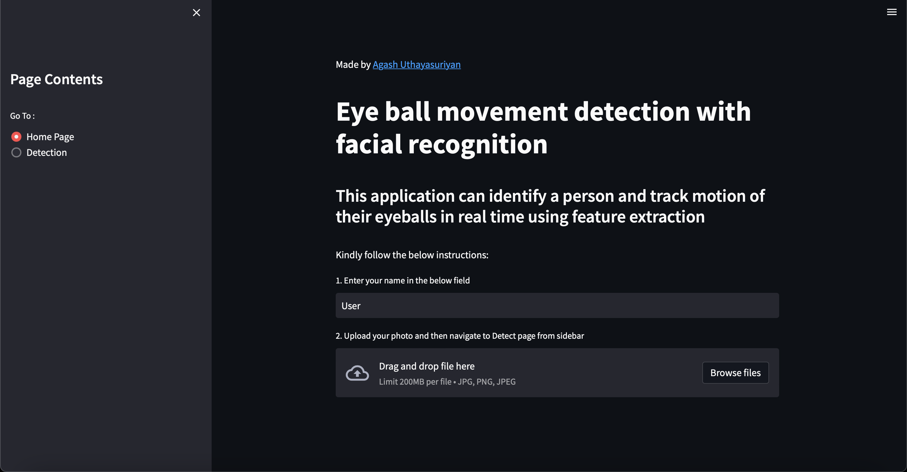

# Eye Movement tracking with facial recognition

This application can track the user's eye balls in real time and also recognise them

## Installation

Run the below code in terminal

```bash
pip install -r requirements.txt
```

## Starting the Application

In terminal :

```bash
$ streamlit run main.py
```

Follow the link in terminal to use the application.

This should be the web page:



## Usage

This web based end to end application can be used to:

1. Proctor test-takers in an examination to avoid malpractice
2. Monitor employees in an organisation

And many other situations where an individual has to be observed.
